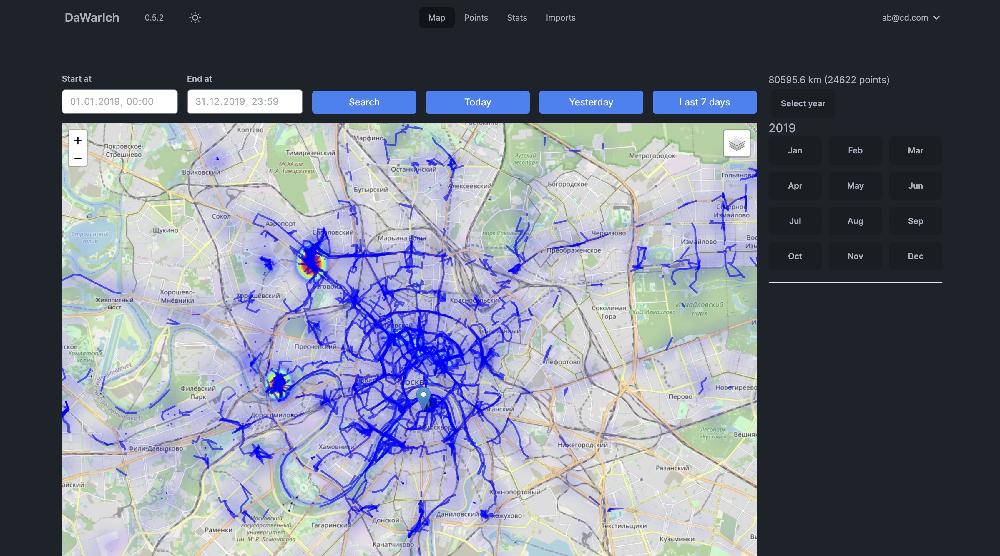
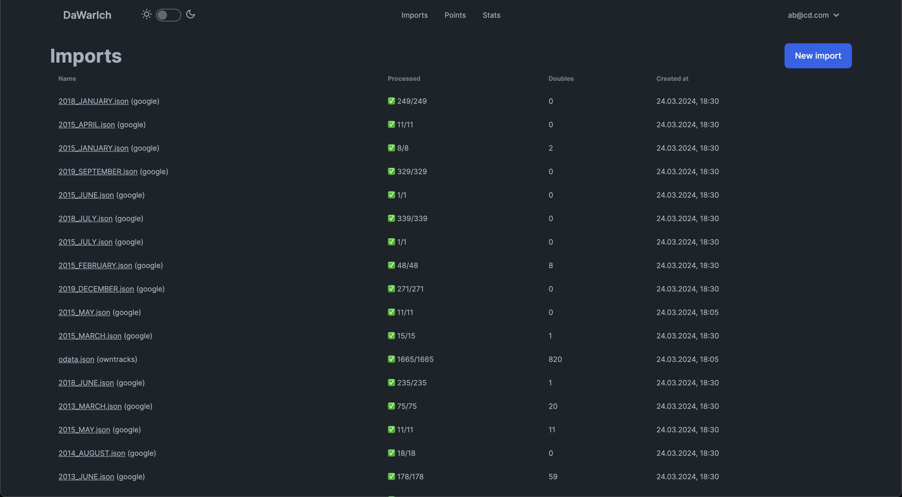

# 🌍 Dawarich: Your Self-Hostable Location History Tracker

[](https://discord.gg/pHsBjpt5J8) | [](https://ko-fi.com/H2H3IDYDD) | [](https://www.patreon.com/freika)

[](https://app.circleci.com/pipelines/github/Freika/dawarich)

---

## 📸 Screenshots


*Map View*


*Statistics Overview*


*Imports page*

---

## 🗺️ About Dawarich

If you're looking for Dawarich Cloud, where everything is managed for you, check out [Dawarich Cloud](https://dawarich.app).

**Dawarich** is a self-hostable web app designed to replace Google Timeline (aka Google Location History).
It enables you to:

- Track your location history.
- Visualize your data on an interactive map.
- Import your location history from Google Maps Timeline, OwnTracks, GPX, GeoJSON and some other sources
- Explore statistics like the number of countries and cities visited, total distance traveled, and more!

📄 **Changelog**: Find the latest updates [here](CHANGELOG.md).

👩‍💻 **Contribute**: See [CONTRIBUTING.md](CONTRIBUTING.md) for how to contribute to Dawarich.
---

## ⚠️ Disclaimer

- 💔 **DO NOT UPDATE AUTOMATICALLY**: Read release notes before updating. Automatic updates may break your setup.
- 🛠️ **Under active development**: Expect frequent updates, bugs, and breaking changes.
- ❌ **Do not delete your original data** after importing into Dawarich.
- 📦 **Backup before updates**: Always [backup your data](https://dawarich.app/docs/tutorials/backup-and-restore) before upgrading.
- 🔄 **Stay up-to-date**: Make sure you're running the latest version for the best experience.
- ⚠️ **DO NOT USE PRODUCTION ENVIRONMENT**: Dawarich is not yet ready for production.

---

## 🧭 Supported Location Tracking

You can track your location with the following apps:

- 💫 [Dawarich for iOS](https://dawarich.app/docs/dawarich-for-ios/)
- 🌍 [Overland](https://dawarich.app/docs/tutorials/track-your-location#overland)
- 🛰️ [OwnTracks](https://dawarich.app/docs/tutorials/track-your-location#owntracks)
- 🗺️ [GPSLogger](https://dawarich.app/docs/tutorials/track-your-location#gps-logger)
- 📱 [PhoneTrack](https://dawarich.app/docs/tutorials/track-your-location#phonetrack)
- 🏡 [Home Assistant](https://dawarich.app/docs/tutorials/track-your-location#home-assistant)

Simply install one of the supported apps on your device and configure it to send location updates to your Dawarich instance.

---

## 🚀 How to Start Dawarich Locally

1. Clone the repository.
2. Run the following command to start the app:
   ```bash
   docker-compose -f docker/docker-compose.yml up
   ```
3. Access the app at `http://localhost:3000`.

⏹️ **To stop the app**, press `Ctrl+C`.

---

## 🔧 How to Install Dawarich

- **[Docker Setup](https://dawarich.app/docs/intro#setup-your-dawarich-instance)**
- **[Synology](https://dawarich.app/docs/tutorials/platforms/synology)**

🆕 **Default Credentials**
- **Username**: `demo@dawarich.app`
- **Password**: `password`
Feel free to change them in the account settings.

---

## 📊 Features

### 🔍 Location Tracking
- Track your live location using one of the [supported apps](#-supported-location-tracking).

### 🗺️ Location History Visualization
- View your historical data on a map with customizable layers:
  - Heatmap
  - Points
  - Lines between points
  - Fog of War

### 🔵 Areas
- Draw areas on the map so Dawarich could suggest your visits there.

### 📍 Visits (Beta)
- Dawarich can suggest places you've visited and allow you to confirm or reject them.

### 📊 Statistics
- Analyze your travel history: number of countries/cities visited, distance traveled, and time spent, broken down by year and month.

### ✈️ Trips

- Create a trip to visualize your travels between two points in time. You'll be able to see the route, distance, and time spent, and also add notes to your trip. If you have Immich or Photoprism integration, you'll also be able to see photos from your trips!

### 📸 Integrations
- Provide credentials for Immich or Photoprism (or both!) and Dawarich will automatically import geodata from your photos.
- You'll also be able to visualize your photos on the map!

### 📥 Import Your Data
- Import from various sources:
  - Google Maps Timeline
  - OwnTracks
  - Strava
  - Immich
  - GPX/GeoJSON files
  - Photos’ EXIF data

### 📤 Export Your Data
- Export your data to GeoJSON or GPX formats.

---

## 📚 Guides and Tutorials

- [Set up Reverse Proxy](https://dawarich.app/docs/tutorials/reverse-proxy)
- [Import Google Takeout](https://dawarich.app/docs/tutorials/import-existing-data#sources-of-data)
- [Track Location with Overland](https://dawarich.app/docs/tutorials/track-your-location#overland)
- [Track Location with OwnTracks](https://dawarich.app/docs/tutorials/track-your-location#owntracks)
- [Export Your Data](https://dawarich.app/docs/tutorials/export-your-data)

🛠️ More guides available in the [Docs](https://dawarich.app/docs/intro).

---

## 🛠️ Environment Variables

Check the documentation on the [website](https://dawarich.app/docs/environment-variables-and-settings) for detailed information about environment variables and settings.

---

## 💫 Star History

As you could probably guess, I like statistics.

<a href="https://star-history.com/#Freika/dawarich&Date">
 <picture>
   <source media="(prefers-color-scheme: dark)" srcset="https://api.star-history.com/svg?repos=Freika/dawarich&type=Date&theme=dark" />
   <source media="(prefers-color-scheme: light)" srcset="https://api.star-history.com/svg?repos=Freika/dawarich&type=Date" />
   
 </picture>
</a>
