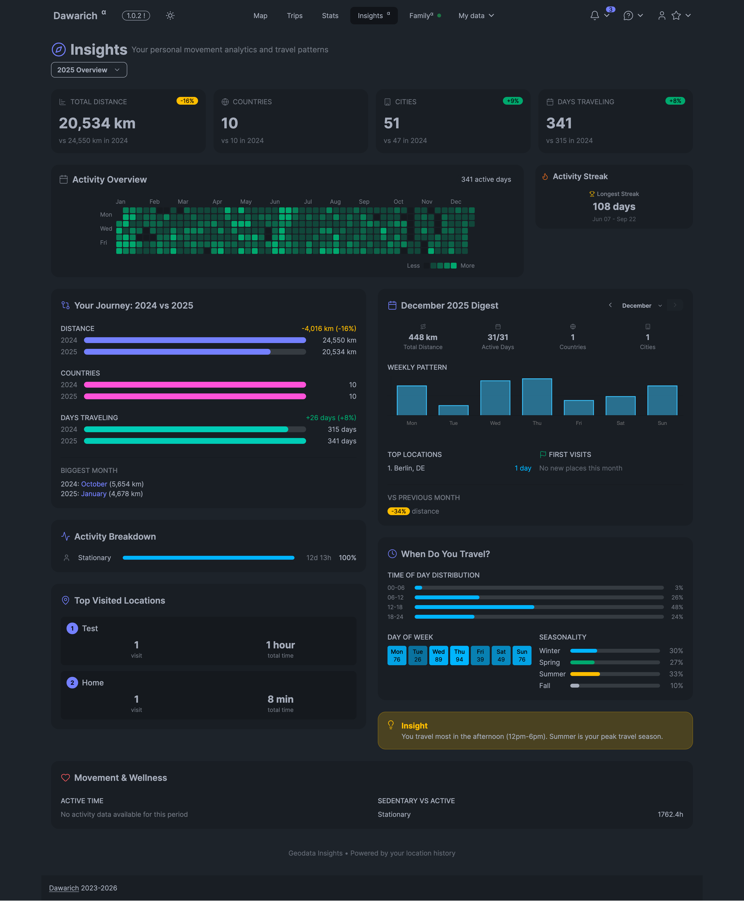
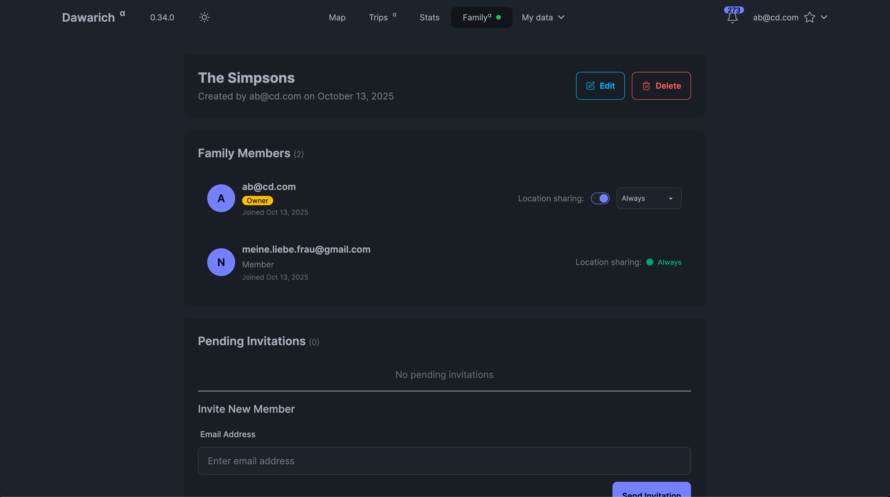
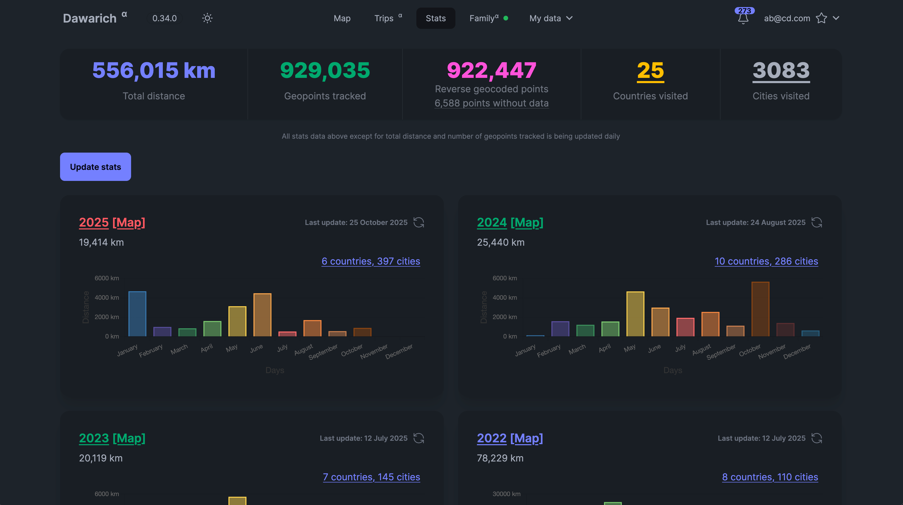
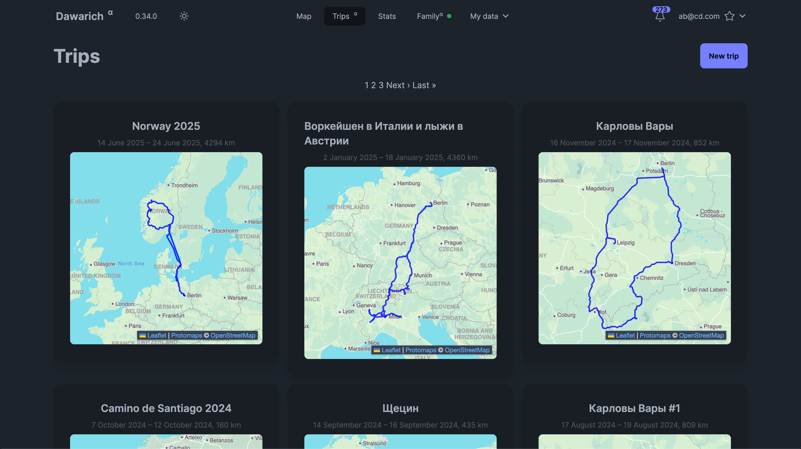

# 🌍 Dawarich: Your Self-Hostable Location History Tracker

[](https://discord.gg/pHsBjpt5J8) | [](https://ko-fi.com/H2H3IDYDD) | [](https://www.patreon.com/freika)

---

## Screenshots


*Map View*


*Insights Page*


*Family Page*


*Statistics Overview*


*Trips page*

---

## About Dawarich

If you're looking for Dawarich Cloud, where everything is managed for you, check out [Dawarich Cloud](https://dawarich.app).

**Dawarich** is a self-hostable web app designed to replace Google Timeline (aka Google Location History).
It enables you to:

- Track your location history.
- Visualize your data on an interactive map.
- Create trips and analyze your travel history.
- Share your location with family members.
- Integrate with photo management apps like Immich and Photoprism to visualize geotagged photos.
- Import your location history from Google Maps Timeline, OwnTracks, GPX, GeoJSON and some other sources
- Explore statistics like the number of countries and cities visited, total distance traveled, and more!
- Share your location with family members.

**Changelog**: Find the latest updates [here](CHANGELOG.md).

**Contribute**: See [CONTRIBUTING.md](CONTRIBUTING.md) for how to contribute to Dawarich.
---

## ⚠️ Disclaimer

### Updating strategy

- **DO NOT UPDATE AUTOMATICALLY**: Read release notes before updating. Automatic updates may break your setup.
- **Under active development**: Expect frequent updates, bugs, and breaking changes.
- **Do not delete your original data** after importing into Dawarich.
- **Backup before updates**: Always [backup your data](https://dawarich.app/docs/tutorials/backup-and-restore) before upgrading.
- **Stay up-to-date**: Make sure you're running the latest version for the best experience.

---

## 🧭 Supported Location Tracking

You can track your location with the following apps:

- 💫 [Dawarich for iOS](https://dawarich.app/docs/dawarich-for-ios/)
- 🤖 [Dawarich for Android](https://dawarich.app/docs/dawarich-for-android/)
- 🗺️ [Dawarich Community](https://github.com/sunstep/dawarich-android) (Android)
- 🌍 [Overland](https://dawarich.app/docs/tutorials/track-your-location#overland)
- 🛰️ [OwnTracks](https://dawarich.app/docs/tutorials/track-your-location#owntracks)
- 🧭 [GPSLogger](https://dawarich.app/docs/tutorials/track-your-location#gps-logger)
- 📱 [PhoneTrack](https://dawarich.app/docs/tutorials/track-your-location#phonetrack)
- 🏡 [Home Assistant](https://dawarich.app/docs/tutorials/track-your-location#home-assistant)

Simply install one of the supported apps on your device and configure it to send location updates to your Dawarich instance.

---

## How to Start Dawarich Locally

1. Clone the repository.
2. Run the following command to start the app:
   ```bash
   docker compose -f docker/docker-compose.yml up
   ```
3. Access the app at `http://localhost:3000`.

**To stop the app**, press `Ctrl+C`.

You can use default values or create a `.env` file based on `.env.example` to customize your setup.

---

## How to Install Dawarich

- **[Docker Setup](https://dawarich.app/docs/intro#setup-your-dawarich-instance)**
- **[Synology](https://dawarich.app/docs/tutorials/platforms/synology)**

**Default Credentials**
- **Username**: `demo@dawarich.app`
- **Password**: `password`
Feel free to change them in the account settings.

---

## Features

### Location Tracking
- Track your live location using one of the [supported apps](#-supported-location-tracking).

### Location History Visualization
- View your historical data on a map with customizable layers:
  - Heatmap
  - Points
  - Lines between points
  - Fog of War

### Family Sharing
- Share your location with family members.
- View locations of family members on the map (with their consent).
- Each family member can enable or disable location sharing individually.

### Areas
- Draw areas on the map so Dawarich could suggest your visits there.

### Visits (Beta)
- Dawarich can suggest places you've visited and allow you to confirm or reject them.

### Statistics
- Analyze your travel history: number of countries/cities visited, distance traveled, and time spent, broken down by year and month.

### Insights

- Get insights about your location history, like "Your most visited place is home, with 120 visits", or "You spent 30 days in Paris in 2024".

### Days in country

- See how many days you've spent in each country. Useful for tax residency purposes or just to see where you spend most of your time.

### Trips
- Create a trip to visualize your travels between two points in time. You'll be able to see the route, distance, and time spent, and also add notes to your trip. If you have Immich or Photoprism integration, you'll also be able to see photos from your trips!

### Integrations
- Provide credentials for Immich or Photoprism (or both!) and Dawarich will automatically import geodata from your photos.
- You'll also be able to visualize your photos on the map!

### Import Your Data
- Import from various sources:
  - Google Maps Timeline
  - OwnTracks
  - Strava
  - Immich
  - GPX/GeoJSON files
  - Photos’ EXIF data

### Export Your Data
- Export your data to GeoJSON or GPX formats.

---

## 📚 Guides and Tutorials

- [Set up Reverse Proxy](https://dawarich.app/docs/tutorials/reverse-proxy)
- [Import Google Takeout](https://dawarich.app/docs/tutorials/import-existing-data#sources-of-data)
- [Track Location with Overland](https://dawarich.app/docs/tutorials/track-your-location#overland)
- [Track Location with OwnTracks](https://dawarich.app/docs/tutorials/track-your-location#owntracks)
- [Export Your Data](https://dawarich.app/docs/tutorials/export-your-data)

More guides available in the [Docs](https://dawarich.app/docs/intro).

---

## Environment Variables

Check the documentation on the [website](https://dawarich.app/docs/environment-variables-and-settings) for detailed information about environment variables and settings.

---

## Star History

As you could probably guess, I like statistics.

<a href="https://star-history.com/#Freika/dawarich&Date">
 <picture>
   <source media="(prefers-color-scheme: dark)" srcset="https://api.star-history.com/svg?repos=Freika/dawarich&type=Date&theme=dark" />
   <source media="(prefers-color-scheme: light)" srcset="https://api.star-history.com/svg?repos=Freika/dawarich&type=Date" />
   
 </picture>
</a>
