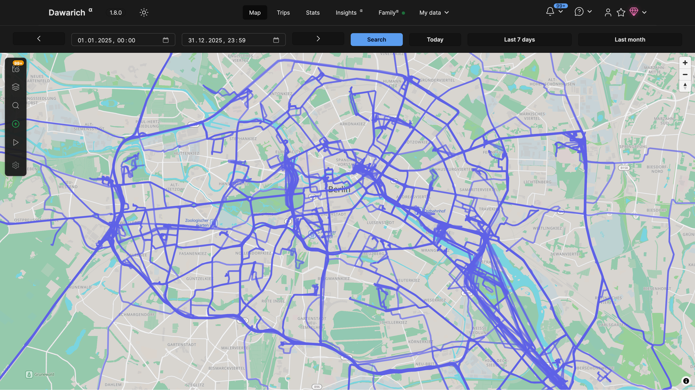
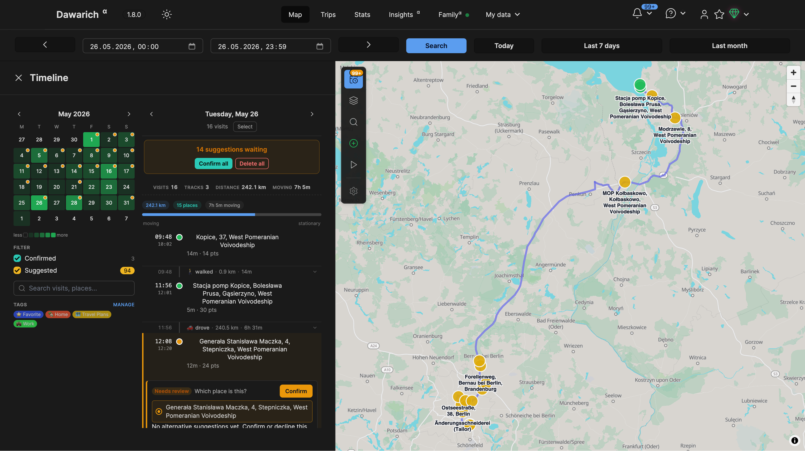
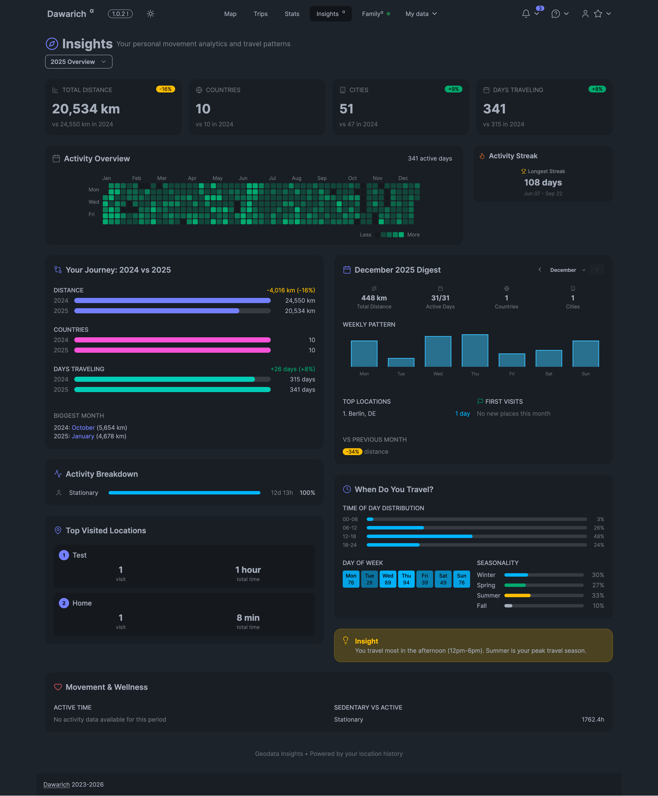
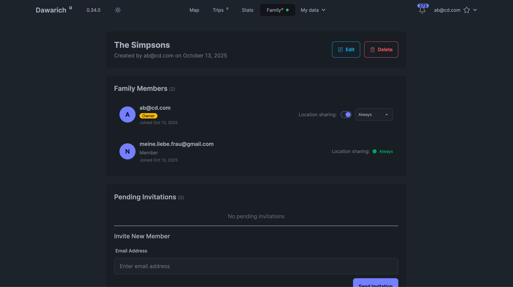
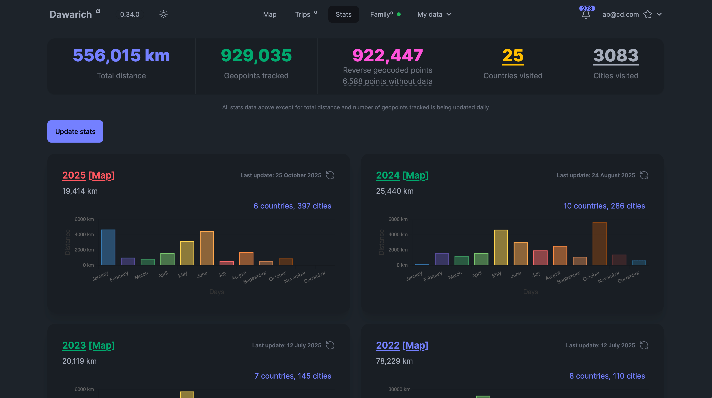
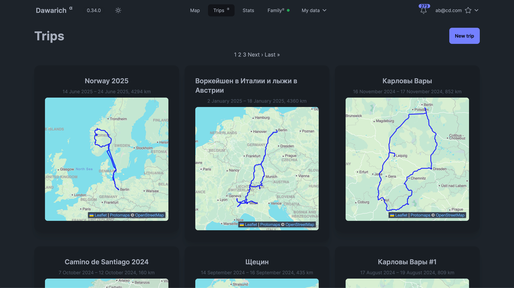

# 🌍 Dawarich：可自托管的位置历史记录追踪器

[English](README.md) | 简体中文

[](https://discord.gg/pHsBjpt5J8) | [](https://ko-fi.com/H2H3IDYDD) | [](https://www.patreon.com/freika) | [](https://app.instapods.com/dashboard/pods/create?app=dawarich&ref=dawarich)

---

## 截图


*地图视图*


*时间线视图*


*洞察页面*


*家庭页面*


*统计概览*


*行程页面*

---

## 关于 Dawarich

如果你在找托管版的 Dawarich Cloud（一切都由官方帮你打理），可以看看 [Dawarich Cloud](https://dawarich.app)。

**Dawarich** 是一个可自托管的 Web 应用，用来替代 Google 时间线（即 Google 位置历史记录）。
它能帮你：

- 追踪你的位置历史记录。
- 在交互式地图上可视化你的数据。
- 创建行程并分析你的旅行历史。
- 与家庭成员共享你的位置。
- 与 Immich、Photoprism 等照片管理应用集成，可视化带地理信息的照片。
- 从 Google 地图时间线、OwnTracks、GPX、GeoJSON 等多种来源导入你的位置历史记录。
- 探索统计数据，比如去过的国家/城市数量、总旅行距离等等！
- 与家庭成员共享你的位置。

**更新日志**：查看 [CHANGELOG.md](CHANGELOG.md) 获取最新动态。

**参与贡献**：查看 [CONTRIBUTING.md](CONTRIBUTING.md) 了解如何为 Dawarich 做贡献。

---

## ⚠️ 免责声明

### 更新策略

- **请勿自动更新**：升级前请先阅读发行说明。自动更新可能会破坏你的现有配置。
- **项目仍在积极开发中**：预计会有频繁的更新、bug 与破坏性变更。
- **导入 Dawarich 后请勿删除原始数据**。
- **更新前先备份**：升级前请务必[备份你的数据](https://dawarich.app/docs/tutorials/backup-and-restore)。
- **保持更新**：为获得最佳体验，请确保运行的是最新版本。

---

## 🧭 支持的位置追踪方式

你可以使用以下应用来追踪你的位置：

- 💫 [Dawarich for iOS](https://dawarich.app/docs/dawarich-for-ios/)
- 🤖 [Dawarich for Android](https://dawarich.app/docs/dawarich-for-android/)
- 🗺️ [Dawarich Community](https://github.com/sunstep/dawarich-android)（Android）
- 🌍 [Overland](https://dawarich.app/docs/tutorials/track-your-location#overland)
- 🛰️ [OwnTracks](https://dawarich.app/docs/tutorials/track-your-location#owntracks)
- 🧭 [GPSLogger](https://dawarich.app/docs/tutorials/track-your-location#gps-logger)
- 📱 [PhoneTrack](https://dawarich.app/docs/tutorials/track-your-location#phonetrack)
- 🏡 [Home Assistant](https://dawarich.app/docs/tutorials/track-your-location#home-assistant)

在你的设备上安装其中一个受支持的应用，并配置它把位置更新发送到你的 Dawarich 实例即可。

---

## 如何在本地启动 Dawarich

1. 克隆本仓库。
2. 运行以下命令启动应用：
   ```bash
   docker compose -f docker/docker-compose.yml up
   ```
3. 访问 `http://localhost:3000` 即可打开应用。

**停止应用**：按下 `Ctrl+C`。

你可以直接使用默认配置，也可以基于 `.env.example` 创建 `.env` 文件来自定义你的配置。

---

## 如何安装 Dawarich

- **[Docker 部署](https://dawarich.app/docs/intro#setup-your-dawarich-instance)**
- **[群晖 Synology](https://dawarich.app/docs/tutorials/platforms/synology)**

**默认凭据**
- **用户名**：`demo@dawarich.app`
- **密码**：`safepassword`
可以随时在账户设置中修改它们。

---

## 功能特性

### 位置追踪
- 使用[受支持的应用](#-支持的位置追踪方式)追踪你的实时位置。

### 位置历史可视化
- 在地图上查看你的历史数据，支持多种可自定义图层：
  - 热力图
  - 轨迹点
  - 点与点之间的连线
  - 战争迷雾

### 家庭共享
- 与家庭成员共享你的位置。
- 查看家庭成员的位置（需经过他们同意）。
- 每位家庭成员都可以单独开启或关闭位置共享。

### 区域
- 在地图上绘制区域，让 Dawarich 帮你识别在此处的到访记录。

### 到访记录（测试版）
- Dawarich 能够识别你去过的地点，并让你确认或拒绝这些记录。

### 统计
- 分析你的旅行历史：按年、按月细分的去过国家/城市数量、旅行距离、花费时间等。

### 洞察

- 获取关于你的位置历史的洞察，比如"你去得最多的地方是家，共到访 120 次"，或"你在 2024 年于巴黎待了 30 天"。

### 在各国停留天数

- 查看你在每个国家停留了多少天。无论是用于税务居民身份判定，还是单纯想知道自己大部分时间待在哪里，都很实用。

### 行程
- 创建一段行程，可视化你在两个时间点之间的旅行轨迹。你可以查看路线、距离和花费的时间，还能为行程添加备注。如果你集成了 Immich 或 Photoprism，还能看到行程中拍摄的照片！

### 集成
- 提供 Immich 或 Photoprism（甚至两者都提供！）的凭据后，Dawarich 会自动从你的照片中导入地理数据。
- 你还可以在地图上可视化你的照片！

### 导入你的数据
- 支持从多种来源导入：
  - Google 地图时间线
  - OwnTracks
  - Strava
  - Immich
  - GPX/GeoJSON 文件
  - 照片的 EXIF 数据

### 导出你的数据
- 将你的数据导出为 GeoJSON 或 GPX 格式。

---

## 📚 指南与教程

- [配置反向代理](https://dawarich.app/docs/tutorials/reverse-proxy)
- [导入 Google Takeout 数据](https://dawarich.app/docs/tutorials/import-existing-data#sources-of-data)
- [使用 Overland 追踪位置](https://dawarich.app/docs/tutorials/track-your-location#overland)
- [使用 OwnTracks 追踪位置](https://dawarich.app/docs/tutorials/track-your-location#owntracks)
- [导出你的数据](https://dawarich.app/docs/tutorials/export-your-data)

更多指南请查看[官方文档](https://dawarich.app/docs/intro)。

---

## 环境变量

关于环境变量与配置项的详细说明，请查阅[官网文档](https://dawarich.app/docs/environment-variables-and-settings)。

---

## Star 历史

你大概也猜到了，我（作者）挺喜欢看统计数据的。

<a href="https://star-history.com/#Freika/dawarich&Date">
 <picture>
   <source media="(prefers-color-scheme: dark)" srcset="https://api.star-history.com/svg?repos=Freika/dawarich&type=Date&theme=dark" />
   <source media="(prefers-color-scheme: light)" srcset="https://api.star-history.com/svg?repos=Freika/dawarich&type=Date" />
   
 </picture>
</a>

---

## 关于本中文分支

本仓库（[dawarich-zh](https://github.com/AwHsR15/dawarich-zh)）是 [Freika/dawarich](https://github.com/Freika/dawarich) 的中文本地化分支，通过标准的 Rails I18n 机制新增了简体中文语言包（`config/locales/zh.yml` 等），在设置页即可切换为中文界面，不改动原有源码结构，便于持续同步上游更新。
