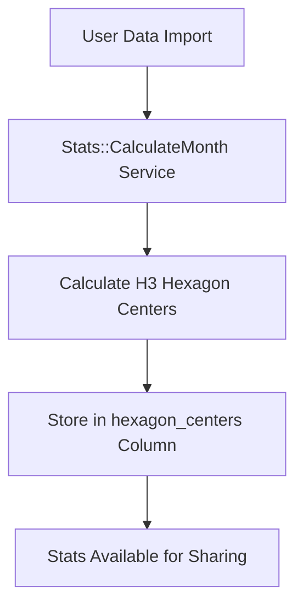
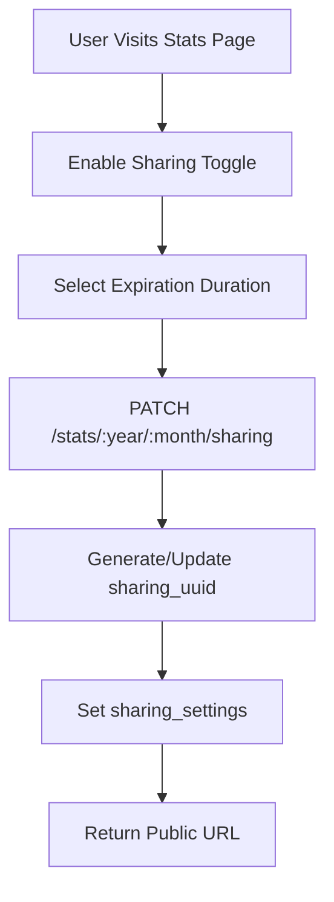
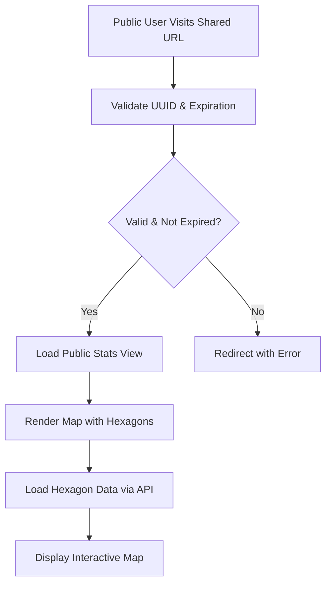
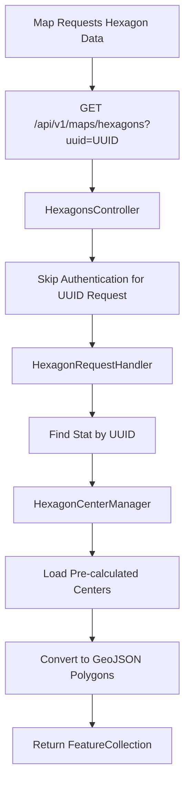

# Shareable Stats Feature Documentation

## Overview

The Shareable Stats feature allows Dawarich users to publicly share their monthly location statistics without requiring authentication. This system provides a secure, time-limited way to share location insights while maintaining user privacy through configurable expiration settings and unguessable UUID-based access.

## Key Features

- **Time-based expiration**: Share links can expire after 1 hour, 12 hours, 24 hours, or be permanent
- **UUID-based security**: Each shared stat has a unique, unguessable UUID for secure access
- **Public API access**: Hexagon map data can be accessed via API without authentication when sharing is enabled
- **H3 Hexagon visualization**: Enhanced geographic data visualization using Uber's H3 hexagonal hierarchical spatial index
- **Automatic expiration**: Expired shares are automatically inaccessible
- **Privacy controls**: Users can enable/disable sharing and regenerate sharing URLs at any time

## Database Schema

### Stats Table Extensions

The sharing functionality extends the `stats` table with the following columns:

```sql
-- Public sharing configuration
sharing_settings JSONB DEFAULT {}
sharing_uuid UUID

-- Pre-calculated H3 hexagon data for performance
h3_hex_ids JSONB DEFAULT {}

-- Indexes for performance
INDEX ON h3_hex_ids USING GIN WHERE (h3_hex_ids IS NOT NULL AND h3_hex_ids != '{}'::jsonb)
```

### Sharing Settings Structure

```json
{
  "enabled": true,
  "expiration": "24h",  // "1h", "12h", "24h", or "permanent"
  "expires_at": "2024-01-15T12:00:00Z"
}
```

### H3 Hex IDs Data Format

The `h3_hex_ids` column stores pre-calculated H3 hexagon data as a hash:

```json
{
  "8a1fb46622dffff": [15, 1640995200, 1640998800],
  "8a1fb46622e7fff": [8, 1640996400, 1640999200],
  // ... more H3 index entries
  // Format: { "h3_index_string": [point_count, earliest_timestamp, latest_timestamp] }
}
```

## Architecture Components

### Models

#### Stat Model (`app/models/stat.rb`)

**Key Methods:**
- `sharing_enabled?`: Checks if sharing is enabled
- `sharing_expired?`: Validates expiration status
- `public_accessible?`: Combined check for sharing availability
- `hexagons_available?`: Verifies pre-calculated H3 hex data exists
- `enable_sharing!(expiration:)`: Enables sharing with expiration
- `disable_sharing!`: Disables sharing
- `generate_new_sharing_uuid!`: Regenerates sharing UUID
- `calculate_data_bounds`: Calculates geographic bounds for the month

### Controllers

#### Shared::StatsController (`app/controllers/shared/stats_controller.rb`)

Handles public sharing functionality:

**Routes:**
- `GET /shared/stats/:uuid` - Public view of shared stats
- `PATCH /stats/:year/:month/sharing` - Sharing management (authenticated)

**Key Methods:**
- `show`: Renders public stats view without authentication
- `update`: Manages sharing settings (enable/disable, expiration)

#### Api::V1::Maps::HexagonsController (`app/controllers/api/v1/maps/hexagons_controller.rb`)

Provides hexagon data for both authenticated and public access:

**Features:**
- Skip authentication for public sharing requests (`uuid` parameter)
- Context resolution for public vs. authenticated access
- Error handling for missing or expired shares

```ruby
# Public access via UUID
GET /api/v1/maps/hexagons?uuid=SHARING_UUID

# Authenticated access
GET /api/v1/maps/hexagons?start_date=2024-01-01&end_date=2024-01-31
```

### Services

#### Maps::HexagonRequestHandler (`app/services/maps/hexagon_request_handler.rb`)

Central service for processing hexagon requests:

**Workflow:**
1. Attempts to find matching stat for the request
2. Delegates to `HexagonCenterManager` for pre-calculated data
3. Returns empty feature collection if no data available

#### Maps::HexagonCenterManager (`app/services/maps/hexagon_center_manager.rb`)

Manages pre-calculated H3 hexagon data:

**Responsibilities:**
- Retrieves pre-calculated H3 hex IDs from database
- Converts stored H3 indexes to GeoJSON polygons
- Builds hexagon features with point counts and timestamps
- Handles efficient polygon generation from H3 indexes

**Data Flow:**
1. Check if pre-calculated H3 hex IDs are available
2. Convert H3 indexes to hexagon polygons using `HexagonPolygonGenerator`
3. Build GeoJSON FeatureCollection with metadata and point counts

#### Stats::CalculateMonth (`app/services/stats/calculate_month.rb`)

Responsible for calculating and storing hexagon data during stats processing:

**H3 Configuration:**
- `DEFAULT_H3_RESOLUTION = 8`: Small hexagons for good detail
- `MAX_HEXAGONS = 10_000`: Maximum to prevent memory issues

**Key Methods:**
- `calculate_h3_hex_ids`: Main method for H3 calculation and storage
- `calculate_h3_hexagon_centers`: Internal H3 calculation logic
- `calculate_h3_indexes`: Groups points into H3 hexagons
- `fetch_user_points_for_period`: Retrieves points for date range

**Algorithm:**
1. Fetch user points for the specified month
2. Convert each point to H3 index at specified resolution
3. Aggregate points per hexagon with count and timestamp bounds
4. Apply resolution reduction if hexagon count exceeds maximum
5. Store as hash of { h3_index_string => [count, earliest, latest] }

#### Maps::HexagonPolygonGenerator (`app/services/maps/hexagon_polygon_generator.rb`)

Converts H3 indexes back to polygon geometry:

**Features:**
- Uses H3 library for accurate hexagon boundaries
- Converts coordinates to GeoJSON Polygon format
- Supports both center-based and H3-index-based generation
- Direct H3 index to polygon conversion for efficiency

**Usage Modes:**
- **Center-based**: `new(center_lng: lng, center_lat: lat)`

## H3 Hexagon System

### What is H3?

H3 is Uber's Hexagonal Hierarchical Spatial Index that provides:
- **Uniform coverage**: Earth divided into hexagonal cells
- **Hierarchical resolution**: 16 levels from global to local
- **Efficient indexing**: Fast spatial queries and aggregations
- **Consistent shape**: Hexagons have uniform neighbors

### Resolution Levels

Dawarich uses H3 resolution 8 by default:
- **Resolution 8**: ~737m average hexagon edge length
- **Fallback mechanism**: Reduces resolution if too many hexagons
- **Maximum limit**: 10,000 hexagons to prevent memory issues

### Performance Benefits

1. **Pre-calculation**: H3 hexagons calculated once during stats processing
2. **Efficient storage**: Hash-based storage with H3 index as key
3. **Fast retrieval**: Database lookup instead of real-time calculation
4. **Reduced bandwidth**: Compact JSON hash format for API responses
5. **Direct polygon generation**: H3 index directly converts to polygon boundaries

## Workflow

### 1. Stats Calculation Process



**Detailed Steps:**
1. User imports location data (GPX, JSON, etc.)
2. Background job triggers `Stats::CalculateMonth`
3. Service calculates monthly statistics including H3 hex IDs
4. H3 indexes are calculated for all points in the month
5. Results stored in `stats.h3_hex_ids` as JSON hash

### 2. Sharing Activation



**Sharing Settings:**
- **Expiration options**: 1h, 12h, 24h, permanent
- **UUID generation**: Secure random UUID for each stat
- **Expiration timestamp**: Calculated and stored in sharing_settings

### 3. Public Access Flow



**Security Checks:**
1. Verify sharing UUID exists in database
2. Check `sharing_settings.enabled = true`
3. Validate expiration timestamp if not permanent
4. Return 404 if any check fails

### 4. Hexagon Data Retrieval



**Data Transformation:**
1. Retrieve stored H3 hex IDs hash from database
2. Convert each H3 index to hexagon boundary coordinates
3. Build GeoJSON Feature with properties (point count, timestamps)
4. Return complete FeatureCollection for map rendering

## API Endpoints

### Public Sharing

#### View Shared Stats
```http
GET /shared/stats/:uuid
```
- **Authentication**: None required
- **Response**: HTML page with public stats view
- **Error Handling**: Redirects to root with alert if invalid/expired

#### Get Hexagon Data
```http
GET /api/v1/maps/hexagons?uuid=:uuid
```
- **Authentication**: None required for UUID access
- **Response**: GeoJSON FeatureCollection
- **Features**: Each feature represents one hexagon with point count and timestamps

### Authenticated Management

#### Toggle Sharing
```http
PATCH /stats/:year/:month/sharing
```
**Parameters:**
- `enabled`: "1" to enable, "0" to disable
- `expiration`: "1h", "12h", "24h", or "permanent" (when enabling)

**Response:**
```json
{
  "success": true,
  "sharing_url": "https://domain.com/shared/stats/uuid",
  "message": "Sharing enabled successfully"
}
```

## Security Features

### UUID-based Access
- **Unguessable URLs**: Uses secure random UUIDs
- **No enumeration**: Can't guess valid sharing links
- **Automatic generation**: New UUID created for each sharing activation

### Time-based Expiration
- **Configurable duration**: Multiple expiration options
- **Automatic enforcement**: Expired shares become inaccessible
- **Precise timestamping**: ISO8601 format with timezone awareness

### Limited Data Exposure
- **No user identification**: Public view doesn't expose user details
- **Aggregated data only**: Only statistical summaries are shared
- **No raw location points**: Individual coordinates not exposed

### Privacy Controls
- **User control**: Users can enable/disable sharing at any time
- **UUID regeneration**: Can generate new sharing URL to invalidate old ones
- **Granular permissions**: Per-month sharing control

## Frontend Integration

### Public View Template (`app/views/stats/public_month.html.erb`)

**Features:**
- **Responsive design**: Mobile-friendly layout with Tailwind CSS
- **Monthly statistics**: Distance, active days, countries visited
- **Interactive hexagon map**: Leaflet.js with H3 hexagon overlay
- **Activity charts**: Daily distance visualization
- **Location summary**: Countries and cities visited

**Map Integration:**
```erb
<div id="public-monthly-stats-map"
     data-controller="public-stat-map"
     data-public-stat-map-uuid-value="<%= @stat.sharing_uuid %>"
     data-public-stat-map-hexagons-available-value="<%= @hexagons_available.to_s %>">
</div>
```

### JavaScript Controller

**Stimulus Controller**: `public-stat-map`
- **Leaflet initialization**: Sets up interactive map
- **Hexagon layer**: Loads and renders hexagon data from API
- **User interaction**: Click handlers, zoom controls
- **Loading states**: Shows loading spinner during data fetch

## Performance Considerations

### Pre-calculation Strategy
- **Background processing**: Hexagons calculated during stats job
- **Storage efficiency**: H3 indexes are compact
- **Query optimization**: GIN index on hexagon_centers column
- **Caching**: Pre-calculated data serves multiple requests

### Memory Management
- **Hexagon limits**: Maximum 10,000 hexagons per month
- **Resolution fallback**: Automatically reduces detail for large areas
- **Lazy loading**: Only calculate when stats are processed
- **Efficient formats**: JSON storage optimized for size

### Database Optimization
```sql
-- Optimized queries
SELECT h3_hex_ids FROM stats
WHERE sharing_uuid = ? AND sharing_settings->>'enabled' = 'true';

-- Index for performance
CREATE INDEX index_stats_on_h3_hex_ids
ON stats USING gin (h3_hex_ids)
WHERE (h3_hex_ids IS NOT NULL AND h3_hex_ids != '{}'::jsonb);
```

## Error Handling

### Validation Errors
- **Missing UUID**: 404 response with user-friendly message
- **Expired sharing**: Redirect with appropriate alert
- **Invalid parameters**: Bad request with error details

### Service Errors
- **H3 calculation failures**: Graceful degradation, logs warning
- **Database errors**: Transaction rollback, user notification
- **Memory issues**: Resolution reduction, retry mechanism

### Frontend Resilience
- **Loading states**: User feedback during data fetching
- **Fallback content**: Display stats even if hexagons fail
- **Error messages**: Clear communication of issues

## Configuration

### Environment Variables
```bash
# H3 hexagon settings (optional, defaults shown)
H3_DEFAULT_RESOLUTION=8
H3_MAX_HEXAGONS=10000

# Feature flags
ENABLE_PUBLIC_SHARING=true
```

### Runtime Configuration
- **Resolution adaptation**: Automatic based on data size
- **Expiration options**: Configurable in sharing settings
- **Security headers**: CORS configuration for API access

## Monitoring and Analytics

### Logging
- **Share creation**: Log when sharing is enabled
- **Public access**: Log UUID-based requests (without exposing UUID)
- **Performance metrics**: H3 calculation timing
- **Error tracking**: Failed calculations and API errors

### Metrics
- **Sharing adoption**: How many users enable sharing
- **Expiration preferences**: Popular expiration durations
- **Performance**: Hexagon calculation and rendering times
- **Error rates**: Failed sharing requests

## Troubleshooting

### Common Issues

#### No Hexagons Displayed
1. Check if `hexagons_available?` returns true
2. Verify `h3_hex_ids` column has data
3. Confirm H3 library is properly installed
4. Check API endpoint returns valid GeoJSON

#### Sharing Link Not Working
1. Verify UUID exists in database
2. Check sharing_settings.enabled = true
3. Validate expiration timestamp
4. Confirm public routes are properly configured

#### Performance Issues
1. Monitor hexagon count (should be < 10,000)
2. Check if resolution is too high for large areas
3. Verify database indexes are present
4. Consider increasing H3_MAX_HEXAGONS if needed

### Debug Commands

```bash
# Check sharing status for a stat
rails runner "
stat = Stat.find_by(sharing_uuid: 'UUID_HERE')
puts stat.public_accessible?
puts stat.hexagons_available?
"

# Verify H3 hex data format
rails runner "
stat = Stat.first
puts stat.h3_hex_ids.class
puts stat.h3_hex_ids.first
"
```

## Future Enhancements

### Planned Features
- **Social sharing**: Integration with social media platforms
- **Embedding**: Iframe widgets for external sites
- **Analytics**: View count and engagement metrics
- **Custom styling**: User-configurable map themes

### Technical Improvements
- **CDN integration**: Faster global access to shared stats
- **Compression**: Further optimize H3 hex data storage
- **Real-time updates**: Live sharing for ongoing activities
- **API versioning**: Stable API contracts for external integration
- **H3 resolution optimization**: Dynamic resolution based on geographic area

## Conclusion

The Shareable Stats feature provides a robust, secure, and performant way for Dawarich users to share their location insights. The H3 hexagon system offers excellent visualization while maintaining privacy through aggregated data. The UUID-based security model ensures that only intended recipients can access shared statistics, while the configurable expiration system gives users complete control over data visibility.

The architecture is designed for scalability and performance, with pre-calculated data reducing server load and providing fast response times for public viewers. The comprehensive error handling and monitoring ensure reliable operation in production environments.
