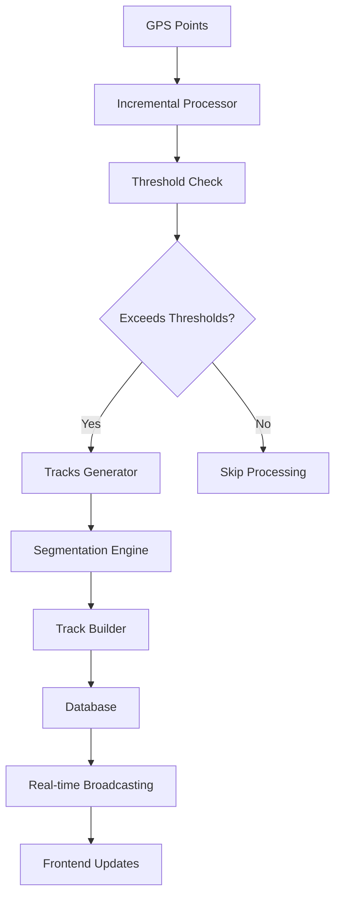

# Dawarich Tracks Feature Overview

## Table of Contents
- [Introduction](#introduction)
- [Architecture Overview](#architecture-overview)
- [Core Components](#core-components)
- [Data Flow](#data-flow)
- [Configuration](#configuration)
- [Usage Examples](#usage-examples)
- [API Reference](#api-reference)
- [Development Guidelines](#development-guidelines)

## Introduction

The Dawarich Tracks feature automatically converts raw GPS points into meaningful movement tracks. It analyzes sequences of location points to identify distinct journeys, providing users with structured visualizations of their movement patterns.

### Key Features
- **Automatic Track Generation**: Converts GPS points into coherent movement tracks
- **Real-time Processing**: Incremental track generation as new points arrive
- **Configurable Thresholds**: User-customizable time and distance parameters
- **Multiple Generation Modes**: Bulk, incremental, and daily processing
- **Rich Statistics**: Distance, speed, elevation, and duration metrics
- **Live Updates**: Real-time track updates via WebSocket connections

## Architecture Overview



## Core Components

### 1. Models

#### Track Model
```ruby
# app/models/track.rb
class Track < ApplicationRecord
  belongs_to :user
  has_many :points, dependent: :nullify

  # Attributes
  # start_at, end_at (DateTime)
  # distance (Integer, meters)
  # avg_speed (Float, km/h)
  # duration (Integer, seconds)
  # elevation_gain/loss/max/min (Integer, meters)
  # original_path (PostGIS LineString)
end
```

#### Point Model
```ruby
# app/models/point.rb
class Point < ApplicationRecord
  belongs_to :track, optional: true
  belongs_to :user

  # Triggers incremental track generation via background job
  after_create_commit :trigger_incremental_track_generation

  private

  def trigger_incremental_track_generation
    Tracks::IncrementalCheckJob.perform_later(user.id, id)
  end
end
```

### 2. Services

#### Tracks::Generator
**Purpose**: Unified track generation service with multiple modes

```ruby
# Usage
Tracks::Generator.new(user, mode: :bulk).call
Tracks::Generator.new(user, mode: :incremental, end_at: Time.current).call
Tracks::Generator.new(user, mode: :daily, start_at: Date.current).call
```

**Modes**:
- `:bulk` - Regenerates all tracks from scratch (replaces existing)
- `:incremental` - Processes only untracked points up to specified time
- `:daily` - Processes tracks on daily basis with cleanup

#### Tracks::IncrementalProcessor
**Purpose**: Analyzes new points and triggers track generation when thresholds are exceeded

```ruby
# Automatically called when new points are created
Tracks::IncrementalProcessor.new(user, new_point).call
```

#### Tracks::Segmentation
**Purpose**: Core algorithm for splitting GPS points into meaningful segments

**Criteria**:
- **Time threshold**: Configurable minutes gap (default: 30 minutes)
- **Distance threshold**: Configurable meters jump (default: 500 meters)
- **Minimum segment size**: 2 points required for valid track

#### Tracks::TrackBuilder
**Purpose**: Converts point arrays into Track records with calculated statistics

**Statistics Calculated**:
- **Distance**: Always stored in meters as integers
- **Duration**: Total time in seconds between first and last point
- **Average Speed**: Calculated in km/h regardless of user preference
- **Elevation Metrics**: Gain, loss, maximum, minimum in meters

### 3. Background Jobs

#### Tracks::IncrementalCheckJob
- **Purpose**: Lightweight job triggered by point creation
- **Queue**: `tracks` for dedicated processing
- **Trigger**: Automatically enqueued when non-import points are created
- **Function**: Checks thresholds and conditionally triggers track generation

#### Tracks::CreateJob
- **Purpose**: Main orchestration job for track creation
- **Features**: User notifications on success/failure
- **Incremental Usage**: Enqueued by IncrementalCheckJob when thresholds are exceeded
- **Parameters**: `user_id`, `start_at`, `end_at`, `mode`

#### Tracks::CleanupJob
- **Purpose**: Weekly cleanup of missed track generation
- **Schedule**: Runs weekly on Sunday at 02:00 via cron
- **Strategy**: Processes only users with old untracked points (1+ days old)

### 4. Real-time Features

#### TracksChannel (ActionCable)
```javascript
// Real-time track updates
consumer.subscriptions.create("TracksChannel", {
  received(data) {
    // Handle track created/updated/destroyed events
  }
});
```

## Data Flow

### 1. Point Creation Flow
```
New Point Created → IncrementalCheckJob → Incremental Processor → Threshold Check →
(if exceeded) → CreateJob → Track Generation → Database Update →
User Notification → Real-time Broadcast → Frontend Update
```

### 2. Bulk Processing Flow
```
Scheduled Job → Load Historical Points → Segmentation →
Track Creation → Statistics Calculation → Database Batch Update
```

### 3. Incremental Processing Flow
```
New Point → IncrementalCheckJob → Find Previous Point → Calculate Time/Distance Gaps →
(if thresholds exceeded) → CreateJob(start_at: last_track_end, end_at: previous_point_time) →
Process Untracked Points → Create Tracks → User Notification
```

## Configuration

### User Settings
Tracks behavior is controlled by user-configurable settings in `Users::SafeSettings`:

```ruby
# Default values
{
  'meters_between_routes' => 500,      # Distance threshold
  'minutes_between_routes' => 30,      # Time threshold
  'route_opacity' => 60,               # Visual opacity
  'distance_unit' => 'km'              # Display unit (km/mi)
}
```

### Threshold Configuration
```ruby
# Time threshold: Gap longer than X minutes = new track
user.safe_settings.minutes_between_routes # default: 30

# Distance threshold: Jump larger than X meters = new track
user.safe_settings.meters_between_routes # default: 500

# Access in services
def time_threshold_minutes
  user.safe_settings.minutes_between_routes.to_i
end
```

### Background Job Schedule
```yaml
# config/schedule.yml
tracks_cleanup_job:
  cron: '0 2 * * 0'  # Weekly on Sunday at 02:00
  class: Tracks::CleanupJob
```

## Usage Examples

### 1. Manual Track Generation

```ruby
# Bulk regeneration (replaces all existing tracks)
Tracks::Generator.new(user, mode: :bulk).call

# Process specific date range
Tracks::Generator.new(
  user,
  start_at: 1.week.ago,
  end_at: Time.current,
  mode: :bulk
).call

# Daily processing
Tracks::Generator.new(
  user,
  start_at: Date.current,
  mode: :daily
).call
```

### 2. Incremental Processing

```ruby
# Triggered automatically when points are created
point = Point.create!(
  user: user,
  timestamp: Time.current.to_i,
  lonlat: 'POINT(-122.4194 37.7749)'
)
# → Automatically enqueues IncrementalCheckJob
# → Job checks thresholds and conditionally triggers track generation
```

### 3. Background Job Management

```ruby
# Enqueue incremental check (automatically triggered by point creation)
Tracks::IncrementalCheckJob.perform_later(user.id, point.id)

# Enqueue incremental processing (triggered by IncrementalCheckJob)
Tracks::CreateJob.perform_later(
  user.id,
  start_at: last_track_end,
  end_at: previous_point_timestamp,
  mode: :none
)

# Run cleanup for missed tracks
Tracks::CleanupJob.perform_later(older_than: 1.day.ago)

# Create tracks with notifications
Tracks::CreateJob.perform_later(user.id, start_at: nil, end_at: nil, mode: :bulk)
```

### 4. Frontend Integration

```javascript
// Initialize tracks on map
const tracksLayer = new TracksLayer(map, tracksData);

// Handle real-time updates
consumer.subscriptions.create("TracksChannel", {
  received(data) {
    switch(data.event) {
      case 'created':
        tracksLayer.addTrack(data.track);
        break;
      case 'updated':
        tracksLayer.updateTrack(data.track);
        break;
      case 'destroyed':
        tracksLayer.removeTrack(data.track.id);
        break;
    }
  }
});
```

## API Reference

### Track Model API

```ruby
# Key methods
track.formatted_distance      # Distance in user's preferred unit
track.distance_in_unit(unit)  # Distance in specific unit
track.recalculate_path_and_distance!  # Recalculate from points

# Scopes
Track.for_user(user)
Track.between_dates(start_date, end_date)
Track.last_for_day(user, date)
```

### TrackSerializer Output
```json
{
  "id": 123,
  "start_at": "2023-01-01T10:00:00Z",
  "end_at": "2023-01-01T11:30:00Z",
  "distance": 5000,
  "avg_speed": 25.5,
  "duration": 5400,
  "elevation_gain": 150,
  "elevation_loss": 100,
  "elevation_max": 300,
  "elevation_min": 200,
  "path": "LINESTRING(...)"
}
```

### Service APIs

```ruby
# Generator API
generator = Tracks::Generator.new(user, options)
generator.call  # Returns nil, tracks saved to database

# Processor API
processor = Tracks::IncrementalProcessor.new(user, point)
processor.call  # May enqueue background job

# Segmentation API (via inclusion)
segments = split_points_into_segments(points)
should_start_new_segment?(current_point, previous_point)
```

## Development Guidelines

### 1. Adding New Generation Modes

```ruby
# In Tracks::Generator
def load_points
  case mode
  when :bulk
    load_bulk_points
  when :incremental
    load_incremental_points
  when :daily
    load_daily_points
  when :custom_mode  # New mode
    load_custom_points
  end
end

def should_clean_tracks?
  case mode
  when :bulk, :daily then true
  when :incremental, :custom_mode then false
  end
end
```

### 2. Customizing Segmentation Logic

```ruby
# Override in including class
def should_start_new_segment?(current_point, previous_point)
  # Custom logic here
  super || custom_condition?(current_point, previous_point)
end
```

### 3. Testing Patterns

```ruby
# Test track generation
expect { generator.call }.to change(Track, :count).by(1)

# Test point callback
expect { point.save! }.to have_enqueued_job(Tracks::IncrementalCheckJob)
  .with(user.id, point.id)

# Test incremental processing
expect(Tracks::CreateJob).to receive(:perform_later)
  .with(user.id, start_at: anything, end_at: anything, mode: :none)
processor.call

# Test segmentation
segments = generator.send(:segment_points, points)
expect(segments.size).to eq(2)
```

### 4. Performance Considerations

- **Batch Processing**: Use `find_in_batches` for large datasets
- **Database Indexes**: Ensure proper indexing on `timestamp` and `track_id`
- **Memory Usage**: Process points in chunks for very large datasets
- **Asynchronous Processing**: Point creation is never blocked by track generation
- **Job Queue Management**: Monitor job queue performance for incremental processing

### 5. Error Handling

```ruby
# In services
begin
  generator.call
rescue StandardError => e
  Rails.logger.error "Track generation failed: #{e.message}"
  # Handle gracefully
end

# In jobs
def perform(*args)
  # Main logic
rescue ActiveRecord::RecordNotFound
  # Don't retry for missing records
rescue StandardError => e
  Rails.logger.error "Job failed: #{e.message}"
  raise # Re-raise for retry logic
end
```

### 6. Monitoring and Debugging

```ruby
# Add logging
Rails.logger.info "Generated #{segments.size} tracks for user #{user.id}"

# Performance monitoring
Rails.logger.info "Track generation took #{duration}ms"

# Debug segmentation
Rails.logger.debug "Threshold check: time=#{time_gap}min, distance=#{distance_gap}m"
```

## Best Practices

1. **Data Consistency**: Always store distances in meters, convert only for display
2. **Threshold Configuration**: Make thresholds user-configurable for flexibility
3. **Error Handling**: Gracefully handle missing data and network issues
4. **Performance**: Use database queries efficiently, avoid N+1 queries
5. **Testing**: Test all modes and edge cases thoroughly
6. **Real-time Updates**: Use ActionCable for responsive user experience
7. **Background Processing**: Use appropriate queues for different job priorities
8. **Asynchronous Design**: Never block point creation with track generation logic
9. **Job Monitoring**: Monitor background job performance and failure rates

## Troubleshooting

### Common Issues

1. **Missing Tracks**: Check if points have `track_id: nil` for incremental processing
2. **Incorrect Thresholds**: Verify user settings configuration
3. **Job Failures**: Check background job logs for errors
4. **Real-time Updates**: Verify WebSocket connection and channel subscriptions
5. **Performance Issues**: Monitor database query performance and indexing

### Debugging Tools

```ruby
# Check track generation
user.tracked_points.where(track_id: nil).count  # Untracked points

# Verify thresholds
user.safe_settings.minutes_between_routes
user.safe_settings.meters_between_routes

# Test segmentation
generator = Tracks::Generator.new(user, mode: :bulk)
segments = generator.send(:segment_points, points)
```

This overview provides a comprehensive understanding of the Dawarich Tracks feature, from high-level architecture to specific implementation details.
