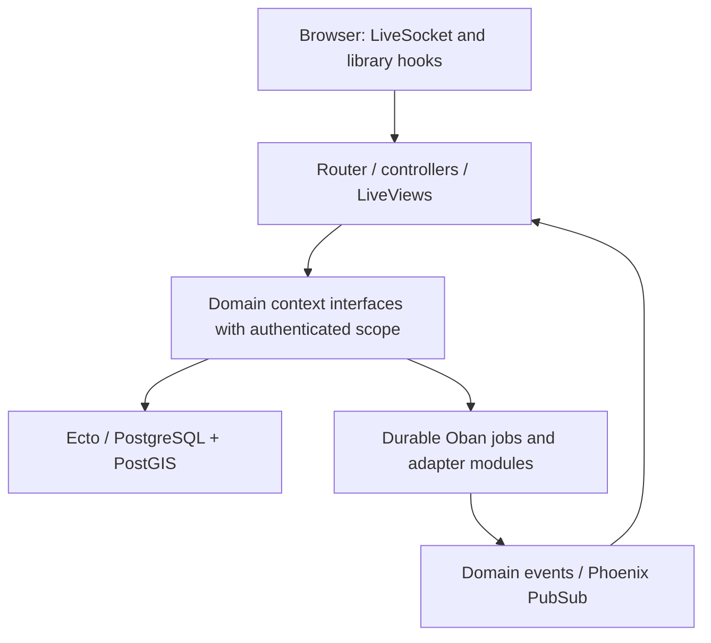

# Phoenix-native frontend, LiveView and contexts — implementation plan

Date: 2026-10-08. Status: decisions taken (ADR-0017, workspace `docs/adr/0017-phoenix-native-frontend-without-hotwire.md`); milestones 0–2 are done (2026-10-09, branch `feat/native-frontend`, results in `native-frontend-inventory.md`) by `superpowers/plans/2026-10-08-phoenix-native-frontend-plan.md`; milestone 3 is split into 3a–3d: 3a (general/visits/integrations settings with TREK, `/users/edit` with native ZIP upload) is done (2026-10-09, branch `feat/native-m3a`, results in `native-m3a-inventory.md`) by `superpowers/plans/2026-10-09-phoenix-native-milestone-3-plan.md`; the rest is inventoried in `native-m3b-inventory.md` (branch `feat/native-m3b-inventory`) and needs its own plan. That plan defers admin/public live_sessions, the idle-connection memory baseline beyond Tags and native uploads to later milestones. Coexistence is not kept; only the standalone Playwright lane gates.

## Target and scope

User direction: “Нам не важно иметь turbo и stimulus, фронтенд должен быть переписан с точки зрения best practices phoenix, аналогично лайв вью и контексты. сначала сделай план”.

The final native application must have no Turbo/Stimulus runtime, bridge, controller loader or hidden compatibility shim. Phoenix/LiveView owns ordinary forms, navigation and server state. Browser-only libraries (MapLibre, charts, Trix where still needed, poster/video export) remain ordinary JavaScript modules with explicit Phoenix hook lifecycles. Native assets have their own build and dependency graph.

Preserve user-visible functionality, privacy/access rules, stored data, supported import/export formats, existing public URLs and documented API contracts. Exact Rails HTML, Turbo attributes and internal controller names are no longer acceptance requirements. Retain CSS/theme where useful; DOM can change for native components. Session/wire compatibility for external consumers is a separate contract and must not be removed merely because it contains “Rails” in its name.

Repository: /Users/frey/projects/dawarich/dawarich/.worktrees/phoenix-port, feat/phoenix-port. Baseline review: framework-practices-20261008.md, HEAD 7e90969a7a4d8ad28b3be24d38754635aac3d9ac plus existing uncommitted work. Do not overwrite earlier performance/runtime edits.

## Current size and important dependencies

- 38 LiveView modules, 509 web .ex files, 1,176 domain-directory .ex files in the review inventory.
- 199 web source files match at least one legacy frontend marker: data-controller, data-action, data-turbo, RailsStimulus, turbo-frame or turbo-stream. This is a discovery estimate, not proof that every match is an active dependency.
- 65 *_controller.* source files under app/javascript/controllers; 80 total files under that directory. Phase 0 must determine which are reachable from native pages.
- Native rails_bridge.js dynamically starts Stimulus; map_shell.js imports both Turbo and Stimulus and creates MapApplication instances. family_page.js looks up a Stimulus family-map controller; video_studio_save.js invokes Turbo.renderStreamMessage.
- Native asset production consumes config/importmap.rb and a Sprockets-compatible build implemented in Elixir. There is currently no app-phoenix/assets directory.
- Existing tests explicitly characterize Stimulus bridges, Turbo navigation and form patch isolation.
- Domain-to-web references occur in 86 files. Only three domain files declare Ecto.Schema; that is not by itself a problem.

## Design rules

Use the codebase-design skill's deep-module approach: a small domain interface hides validation, ownership, transactions and persistence. Tests cross the same interface as callers. Internal helper modules remain private implementation details; do not add a pass-through facade per existing file.

Target call direction:

- Domain code does not use Plug.Conn, sockets, HTTP response formats or DawarichWeb presentation helpers. Application supervision and infrastructure/telemetry adapters may reference the web application; keep those explicit exceptions outside business modules.
- Proposed context groups: Accounts; location data (Points, Tracks, Places, Areas, Tags); Trips; Imports; Exports; Families; Sharing; Stats/Digests; Notifications; Settings/Administration. Reuse/deepen existing context modules before creating new ones. Final grouping follows business responsibility, not one context per page.
- Use Accounts.Scope (or equivalent explicit scope) to pass the actor and relevant authorization facts. Context methods enforce ownership; a LiveView event id is always untrusted. Recheck mutable permissions and session validity on relevant events, parameter changes and reconnects.
- Ordinary CRUD uses schemas/changesets and constraints when helpful. Preserve purpose-built schemaless/PostGIS/bulk SQL behind context interfaces. No automatic schema-per-table rewrite.
- Transactions cover persistence and durable job publication; long external calls and expensive calculations stay outside database locks. Use Ecto.Multi when it clarifies atomic operations, not as a blanket replacement for correct existing transactions.
- Function components declare attrs/slots; larger templates use .html.heex. LiveComponent is reserved for a module that needs its own lifecycle/state, not every reusable fragment.
- Small browser-only interactions use Phoenix.LiveView.JS. Hooks wrap libraries and work that must run in the browser.
- Public/download/API/authentication HTTP flows may use normal controllers and href links. Not every HTTP response needs a LiveView process.

## Ordered implementation milestones

### 0. Inventory, contracts and current baseline

Deliverables:

- Matrix for every page/action and reachable Stimulus controller: user behavior, server command, browser module, dependencies, target implementation, test and migration status.
- Inventory Turbo stream/frame responses, ActionCable consumers, rich-text attachment flow, upload paths, public/shared maps and JS entrypoints. Catch transitive Hotwire dependencies such as @rails/actiontext as well as direct imports.
- Classify existing tests into user/data/API invariants versus obsolete internal implementation assertions. Record legitimate expected diffs; do not indiscriminately regenerate fixtures.
- Capture a new baseline on current Elixir 1.20.4 and the exact current source. The old ten-route Elixir 1.18.3 benchmark is historical and cannot be the sole control for this refactor.
- Observe static HTTP mount, WebSocket mount, parameter changes, event query counts, idle connected views, JS transfer/parse cost and memory after repeated navigation.

Gate: every active interaction has an owner and acceptance scenario; public contracts and all distinct auth/live_session boundaries are listed. Record the user's native-only direction alongside ADR-0016 and historical hybrid docs, preserving implementation history.

### 1. Shared Phoenix foundation and operational budgets

Deliverables:

- Native source assets in app-phoenix/assets/js and assets/css, bundled to priv/static/assets. Prefer Phoenix's esbuild integration; adapt it for lazy map/studio bundles, workers and third-party asset loading. Keep current Tailwind/DaisyUI versions initially to avoid a simultaneous redesign.
- mix assets.build/deploy plus phx.digest, watcher configuration and Docker/CI packaging. Native release no longer parses Rails importmap configuration to discover frontend dependencies.
- App layouts/core components: inputs/errors, buttons, flash, dialogs, confirmation, tabs and pagination. Verified routes (~p) and shared shell helpers.
- Accounts.Scope and central HTTP/on_mount authorization policy, with explicit public/user/admin sessions. Cookies and login/logout remain handled correctly through HTTP when session changes require a fresh connection.
- Configurable total JSON/form/upload budgets; count actual bytes for chunked requests; respond 413 on overflow. File uploads spool/stream with separate limits. Include parameter/depth limits, timeouts and cleanup after cancellation.
- Prove native unexpected exceptions reach centralized reporting once with a stacktrace while keeping correct public error responses.

Gate: a small native page builds and renders without loading Hotwire; production asset URLs and lazy chunks work; permissions, parser limits and error reporting have meaningful regressions. Legacy pages may coexist temporarily during implementation; each migrated page has one behavior owner.

### 2. Pilot vertical feature — Tags

Deliverables:

- A compact Tags context interface for list/get/create/update/delete and form validation, taking the authenticated scope and hiding existing SQL/helpers.
- TagsLive.Index and Form use to_form, .form, phx-change, phx-submit, inline errors and ordinary context result tuples.
- Dialogs/emoji/color interactions use JS or focused hooks, without RailsStimulus.
- patch for filters/pagination within the same LiveView; navigate between LiveViews in the same live_session; href/redirect across authentication sessions or HTTP documents.
- Large templates move to adjacent .html.heex where that improves readability.

Gate: create/edit/delete, invalid input, foreign resource ids, double submit, reconnect, unsaved input and back/forward navigation pass. No Turbo/Stimulus dependency in the migrated feature's loaded module graph. Use this feature to validate the design before expanding it.

### 3. Ordinary forms, settings and account/admin pages

Scope: general/visits/integration settings, account editing, onboarding, administrative forms; Places/Areas CRUD and shared UI primitives.

Deliverables:

- Apply the pilot approach with a context interface per business operation.
- Consolidate server validation and changeset/error handling; effects such as mail, recalculation and integration imports enqueue durable work.
- Eliminate ordinary form islands that exist only to protect Stimulus/Turbo edits. Keep hook-owned library DOM explicitly isolated where needed.
- Auth challenges and recovery use conventional Phoenix HTTP or LiveView forms as appropriate; keep CSRF/session semantics and authorization intact.
- Replace ActionText JS integration with a focused editor/attachment adapter where required; preserve rich-text data, sanitization and attachment ownership.

Gate: success/error/loading UX, keyboard/focus/confirmation, account/session changes, role revocation, provider failures and duplicated submissions covered. No feature relies on legacy controller lookup.

### 4. Imports, exports, notifications, family and sharing actions

Deliverables:

- Native uploads through allow_upload/consume_uploaded_entries or external_upload where the existing storage path warrants it, with progress, limits, cancellation and cleanup.
- Imports/Exports context interfaces perform ownership/admission and durable publication; LiveViews display progress through authorized PubSub events.
- Replace browser ActionCable/Turbo stream consumers with LiveView events or explicit Phoenix hooks. Preserve external socket/wire contracts only where an actual independent consumer needs them.
- Notification badge/list refresh becomes event-driven. Remove unconditional ten-second navbar queries; any fallback polling is documented, bounded and justified.
- Family membership/location permissions and share expiry/revocation are checked when loading and when receiving updates. Reconnect reloads authorized state.
- Public unlock flows, signed download URLs and export responses remain valid HTTP flows.

Gate: job failure/retry/cancel/replay, progress after reconnect, expired/revoked links, withdrawn family consent, private data isolation and upload boundaries pass. No native UI consumes turbo-stream responses.

### 5. Data-heavy pages and LiveView lifecycle

Scope: Points, Trips, Visits, Stats, Insights, Digests, Achievements and public/shared views.

Deliverables:

- Extract remaining domain queries/formatting currently mixed across page helpers into the appropriate domain and presentation modules.
- Split mount state from URL-dependent handle_params state; validate filters, dates, sorting and pagination at a single domain interface.
- Use assign_async/start_async for expensive connected-only work with loading/error/cancellation states. Pass small scalar parameters to tasks, not the socket. Prevent stale async responses from replacing newer filters.
- Precompute/persist expensive digest/stat work through jobs and cache; avoid invoking heavy persistent computation as part of a repeated page mount.
- Use streams for growing/live-updated collections, or bounded page assigns for small paginated lists. Do not convert every list just to use streams.
- Cache entries have explicit TTL/invalidation and resource budgets where payload size matters. User/authorization isolation remains part of cache keys and delivery checks.
- Graphs/heatmaps use focused hooks; updates have stable ids and revision/data contracts.

Gate: correct date/timezone/filter behavior, no duplicate expensive work across initial/connected mounts, bounded assigns, cancellation and out-of-order events tested. A navigable URL remains the source of shareable filter state.

### 6. Map, replay, poster and video studios

This is the most coupled frontend milestone and the main sizing uncertainty.

Deliverables:

- Separate current controllers into plain browser modules: map lifecycle, API/tiles, layers/selection, replay clock, editing tools, studio state and export engines.
- Map/Trip/PublicMap/Family hooks own MapLibre instances and register explicit handleEvent/pushEvent integration. No global window.Stimulus, controller registry or renamed Stimulus substitute.
- Server mutations go through scoped context commands; map data remains paginated/streamed through API/tiles, outside LiveView assigns.
- Studio hooks initialize/destroy library instances, workers and portals predictably. Prefer stable keyed containers over DOM portals where possible.
- Abort obsolete fetches; remove listeners/subscriptions/timers; stop animation frames/workers; release WebGL/canvas resources on destruction. Handle reconnect without constructing duplicate maps.
- Preserve useful pure map/render/export algorithms and file formats, while replacing framework-dependent orchestration.

Gate: map layers/search/drawing/selection, trip maps, replay, family/public privacy, poster PNG/PDF and video export work. Repeated navigation, reconnect and cancelled renders show no accumulating maps, listeners, workers or retained GPU/browser state. Lazy chunks and workers work from the production build.

### 7. Remove legacy frontend and simplify web routing

Deliverables:

- Delete native rails_bridge.js, Stimulus startup in map_shell.js, window.Turbo/window.Stimulus dependencies, controller lazy loading, Turbo frame/stream handlers and obsolete HTML attributes.
- Remove direct and transitive Hotwire dependencies from the native package/build graph. Eliminate native reliance on Rails importmap/Sprockets asset resolution once every required asset is accounted for.
- Put LiveViews, controllers, components/templates and request adapters into discoverable feature directories; simplify macro route groups and legacy page envelope/gate behavior where it existed only for the old frontend.
- Keep publicly required URLs/controllers and any actual coexistence/external-client contract until replaced deliberately. Obsolete coexistence paths can be removed once inventory confirms no consumer needs them.
- Replace test-only assertions about bridges/Turbo attributes with native UI behavior checks. Preserve data/API fixtures with real contract value.
- Update runtime/development instructions, AGENTS.md, architecture docs and AFFiNE.

Gate: no native emitted asset, reachable module, network-loaded dependency or active frontend entrypoint requires Turbo/Stimulus. Historical docs/fixtures and a separately supported Rails build do not make this check fail. New contexts have no domain dependency on DawarichWeb; explicit infrastructure exceptions are reviewed.

### 8. Final acceptance and performance comparison

Functional gates:

- Context tests with real Ecto Sandbox transactions: ownership, validation, DB constraints, transaction rollback and durable job publication.
- LiveViewTest for form events, patch/navigation, streams, asynchronous success/failure/stale results and authorized updates.
- Real browser journeys for widgets, maps, studios, uploads, multiple tabs, reconnect, back/forward and focus. JS lifecycle assertions alone are insufficient.
- Full suite, clean warnings-as-errors application compilation, formatting, production asset build and native Docker startup verification.
- Preserve existing public API/data/security assertions; explain every fixture change. New native tests replace obsolete implementation-specific tests instead of retaining two conflicting behavioral oracles.

Performance gates:

- Rerun the established ten page/API routes at 512 MiB and 1 GiB, with identical CPU, database limits, dataset, background-job settings and current Elixir/OTP for baseline and candidate.
- Use k6 arrival-rate tests, warm-up and repeated trials; report achieved goodput, latency p50/p95/p99 and errors/dropped work, not merely maximum RPS.
- Separately exercise connected LiveView users and event mixes with protocol-aware/browser scenarios; HTTP page benchmarks do not measure long-lived socket state.
- Measure application RSS/cgroup peak, BEAM memory/processes, DB query/queue time, queries per mount/event, browser JS bytes and map/studio memory after repeated navigation.
- Require no functional/privacy regressions, no OOM at the agreed workload, and no unexplained latency/resource regression beyond measured run-to-run variation. Set absolute SLOs after phase 0; no invented speedup percentage is promised.

## Execution strategy and completion criteria

Implement sequential, reviewable feature batches. Each batch includes its context interface, LiveView/templates, browser hooks where necessary, relevant tests and docs. Run targeted checks per batch and integration/full gates at meaningful milestones. Do not rewrite all contexts first and postpone user-facing integration.

The first implementation package should be phases 0–2: inventory/current baseline, shared foundations and fully native Tags. Follow with ordinary forms, jobs/sharing, data-heavy pages, maps/studios, cleanup and final comparison. Estimate the remaining batches after the pilot and active-controller inventory; the raw file count is not a delivery estimate.

Completion means the native application has zero Hotwire runtime dependencies, domain operations are accessed through coherent context interfaces, LiveView state/work is bounded, all main user journeys pass, production packaging works, and the new HTTP/socket/resource measurements are available.

## Official reference points

- [Phoenix contexts](https://phoenix.hexdocs.pm/contexts.html) and [Scopes](https://phoenix.hexdocs.pm/scopes.html).
- [LiveView lifecycle, async operations and streams](https://phoenix-live-view.hexdocs.pm/Phoenix.LiveView.html).
- [Forms](https://phoenix-live-view.hexdocs.pm/Phoenix.Component.html#form/1), [live navigation](https://phoenix-live-view.hexdocs.pm/live-navigation.html), [uploads](https://phoenix-live-view.hexdocs.pm/uploads.html).
- [JavaScript hooks](https://phoenix-live-view.hexdocs.pm/js-interop.html), [security model](https://phoenix-live-view.hexdocs.pm/security-model.html).
- [Asset management](https://phoenix.hexdocs.pm/asset_management.html), [schemaless Ecto](https://ecto.hexdocs.pm/schemaless-queries.html), [request budgets](https://plug.hexdocs.pm/Plug.Parsers.html).

